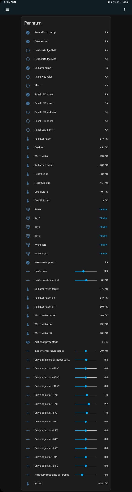
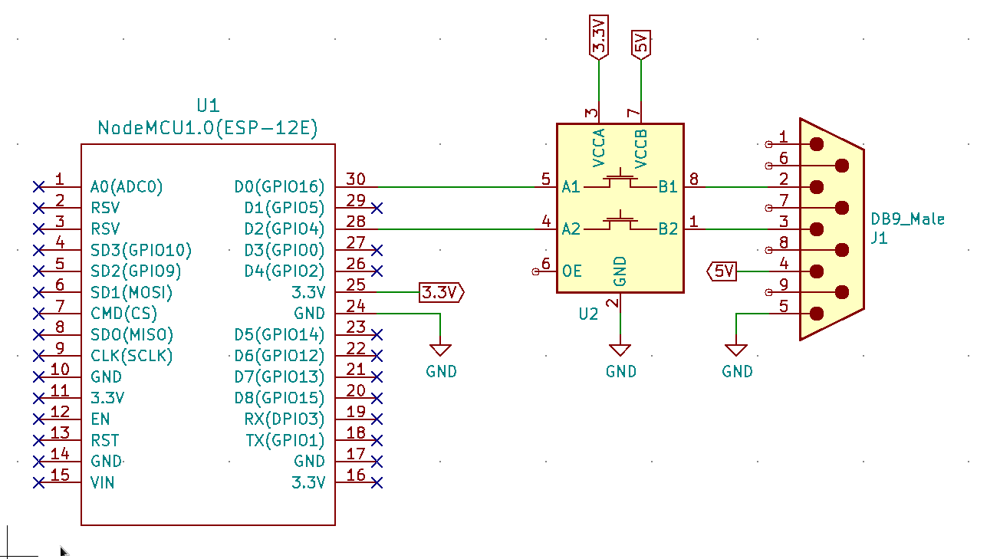

# esphome based Rego 600 controller/supervisor

## Read this part first, you have to!

**I make absolutely no guarantees and take no responsibility for anything done by or with this code.** I wrote this and connected to my own Rego 600, and it still works, but I have no idea what it might do to yours. It's a very expensive piece of equipment that you might destroy by touching the wrong part.

**Take care when connecting anything electrically to your heat pump.** The pump contains three phase power and who knows how sensitive the controller ICs are to electrostatic discharge. I just used a level converter between the serial interface and a nodemcu, but you should use opto-couplers, isolated power supplies, safety carabiners and probably at least three condoms.

**This code is written specifically for the Rego 600.** Not the 636, not the 71042 or whatever. There are documents specifying the registers for other versions so this code can probably be adapted to other models, but you can't and shouldn't use this for anything other than model 600. **If you use this code on any other model, the code might instruct it to detonate, who knows.** The code has no idea what model it is talking to. It might be communicating with a space shuttle or a banana for all it cares.

## What it does

Here's a view in home assistant of the data and controls provided by the code:



## Hardware

You can connect almost any microcontroller directly to the heat pump serial interface. The only caveat is that the heat pump serial interface runs on 5 volts and your microcontroller might be 3.3 volts. In that case you must convert the voltages on the serial interface between them. I used a simple [level converter](https://www.sparkfun.com/products/12009) to do the job, but you might want to consider creating a better circuit using opto-couplers.

If you want to use the configuration as it is, you should connect RX on the Rego 600 (pin 2 on the DB9) to TX on the microcontroller (D0 in this case) and TX on the Rego (pin 3 on the DB9) to RX on the microcontroller (D2), with a level converter inbetween. The DB9 on the Rego has 5 volts out (pin 4), which can be used to drive the high side of the level converter.

The following is a schematic of what I use:



## Building and deploying

If you already have some experience with esphome you might already know what's up. Check out the ```heat_pump.yaml``` and modify it for your use case. You should be able to use any microcontroller that supports esphome and can do UART serial. Change pins if you want to.

If you don't know about esphome you probably have to install it first.

After that you need to create a file called ```secrets.yaml``` in the same folder as the code and add the following to it:

```
wifi_ssid: "Your wifi ssid here"
wifi_password: "Your wifi password here"
```

You might also want to change the "Fallback hotspot" password in the ```heat_pump.yaml``` file.

Unless modified, the ```heat_pump.yaml``` specifies that you use a nodemcuv2 microcontroller, with TX of the UART connected to D0 and RX connected to D2. The inversion is also specified for the circuit with a level converter. If you constructed the hardware in any other way, then this would need to be changed.

Then you should be able to connect your microcontroller and compile/install with the following command:

```
python3 -m esphome run heat_pump.yaml
```

After you've done this once, the same command can also update the firmware on the microcontroller via wifi.

The device should be reachable on your LAN, with the adress http://heatpump/ unless you changed the device name. The API is also enabled so it should be possible to add it to e.g. home assistant with the same name.
